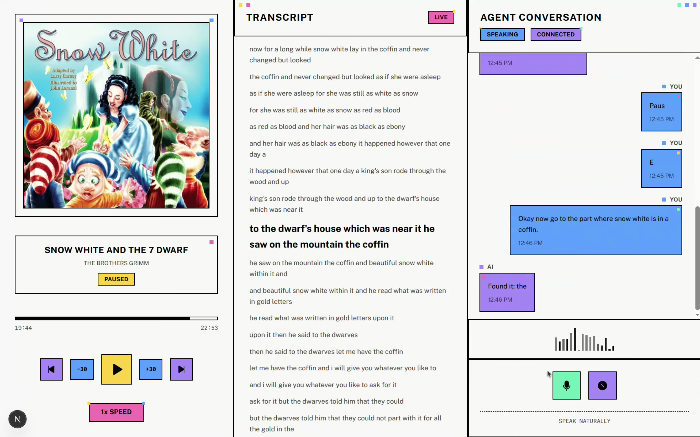

<p align="center">
  
</p>

<h1 align="center">
  Duet - Audiobook Companion
  <br>
</h1>

<h4 align="center">An AI-powered interactive audiobook player that engages users with dynamic, spoiler-free conversations about their favorite books.</h4>

<p align="center">
  <a href="https://reactjs.org/" target="_blank" rel="noopener noreferrer">
    
  </a>
  <a href="https://nextjs.org/" target="_blank" rel="noopener noreferrer">
    
  </a>
  <a href="https://www.python.org/" target="_blank" rel="noopener noreferrer">
    
  </a>
  <a href="https://tailwindcss.com/" target="_blank" rel="noopener noreferrer">
    
  </a>
  <a href="https://livekit.io/" target="_blank" rel="noopener noreferrer">
    
  </a>
</p>

## What is Duet ?

Duet is a fully dynamic, Voice AI companion for your audiobooks. Built with LiveKit, it seamlessly synchronizes with the audiobook you're listening to, allowing you to ask questions, explore character backgrounds, and recap recent events—all completely spoiler-free. 

By mapping playback time to transcript text on the fly, Duet knows exactly where you are in the story, transforming independent listening into an engaging, interactive journey.

## Features

### Voice AI & Interaction
- **Real-Time Voice Companion**: Talk directly to a LiveKit-powered AI agent about your book.
- **Dynamic Context Loading**: Automatically loads title, author, and formatting to adapt to any audiobook.
- **Spoiler-Free Conversations**: The AI maps your playback position against the transcript using calculated Words Per Minute (WPM), ensuring it never reveals what happens next.

### Listening Experience
- **Interactive Audio Player**: Built with React and Next.js, featuring controls for playback, a dynamic playback slider, and direct voice channel initiation.
- **Split-Screen UI**: A new layout combining an interactive transcript view and live audio chat session view.
- **Precise Timecoding & Captions**: Uses VTT (Web Video Text Tracks) captioning to perfectly sync the AI's context window with the current playback time, enabling detailed, spoiler-free, and context-aware responses.
- **Easy Expandability**: Add new audiobooks simply by dropping an MP3, cover image, and transcript (TXT or VTT) into the project directory and updating a JSON config.

## Architecture

The project is structured as a fullstack application across three primary layers:
- **Frontend**: A React/Next.js interface handling media playback, frontend logic, and WebRTC voice channels.
- **Backend Agent**: A Python LiveKit worker that manages dynamic system prompts and conversation flows.
- **Asset Storage**: Local JSON configurations and static audio/transcript assets tightly bundled for quick development.

## Quick Start

### Prerequisites
- Node.js (for frontend)
- Python 3.9+ with `uv` package manager (for backend)
- LiveKit Cloud account (for Real-time Voice AI)

### Environment Setup

1. **Clone the repository**
   ```bash
   git clone <repository-url>
   cd Duet-Audiobook-Companion
   ```

2. **Set up credentials**
   Create a `.env.local` file in the `agent-starter-python` directory and configure your LiveKit credentials:
   ```env
   LIVEKIT_URL=your_livekit_url
   LIVEKIT_API_KEY=your_api_key
   LIVEKIT_API_SECRET=your_api_secret
   ```

3. **Install dependencies**
   ```bash
   # Backend (Python)
   cd agent-starter-python
   uv venv
   source .venv/bin/activate  # On Windows: .venv\Scripts\activate
   uv sync
   
   # Frontend (React)
   cd ../agent-starter-react
   npm install
   ```

### Running the Application

A convenient startup script is provided in the root directory.

```bash
# On Mac/Linux/WSL
./start.sh

# On Windows (Command Prompt / Explorer)
double-click start.bat or run:
start.bat
```

This will automatically spin up the Python background agent and launch the React development server. You can access the interface at `http://localhost:3000`.

## Adding Audiobooks

Adding your own books is straightforward! Follow our [Adding Audiobook Guide](Adding_Audiobook.md) for full formatting details. Essentially:
1. Provide an `mp3` file, cover `jpg`, and a plain text `txt` transcript.
2. Update the `audiobooks.json` file in `agent-starter-react/public`.
3. Startup the application! Duet automatically adapts to the selected title.

## Technologies Used

### Frontend
- **React 19** - UI Framework
- **Next.js 15** - Application Framework
- **Tailwind CSS V4** - Styling Framework
- **LiveKit Components** - WebRTC connection handling

### Backend
- **Python** - Agent Runtime
- **LiveKit Agents SDK** - Voice AI Pipeline
